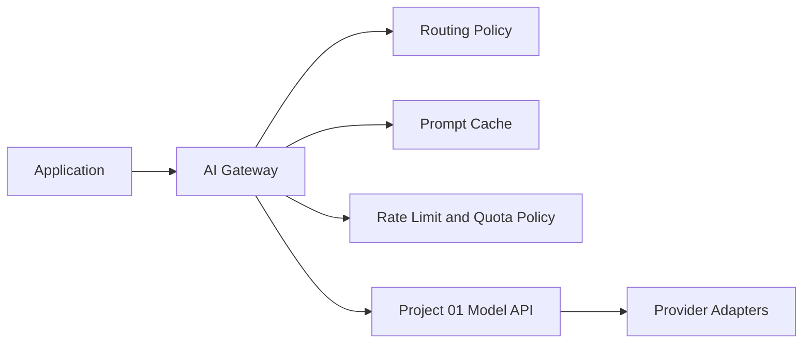
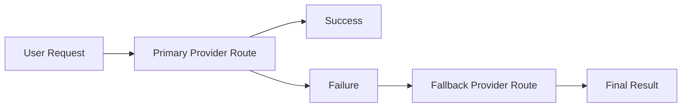
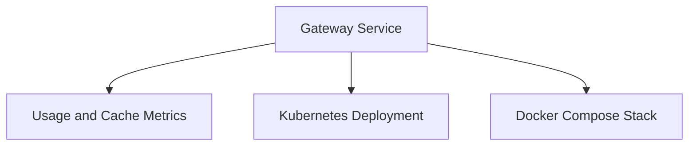

# Module 08 Architecture

```mermaid
flowchart LR
    App[Application] --> Gateway[AI Gateway]
    Gateway --> Route[Routing Policy]
    Gateway --> Cache[Prompt Cache]
    Gateway --> Limits[Rate Limit and Quota Policy]
    Gateway --> ModelAPI[Project 01 Model API]
    ModelAPI --> Providers[Provider Adapters]
```

```mermaid
flowchart LR
    Request[User Request] --> Primary[Primary Provider Route]
    Primary --> Success[Success]
    Primary --> Failure[Failure]
    Failure --> Fallback[Fallback Provider Route]
    Fallback --> Result[Final Result]
```

```mermaid
flowchart TB
    GatewaySvc[Gateway Service] --> Metrics[Usage and Cache Metrics]
    GatewaySvc --> K8s[Kubernetes Deployment]
    GatewaySvc --> Compose[Docker Compose Stack]
```