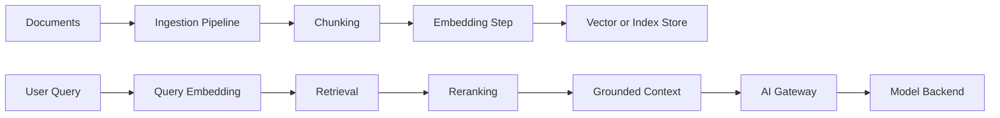
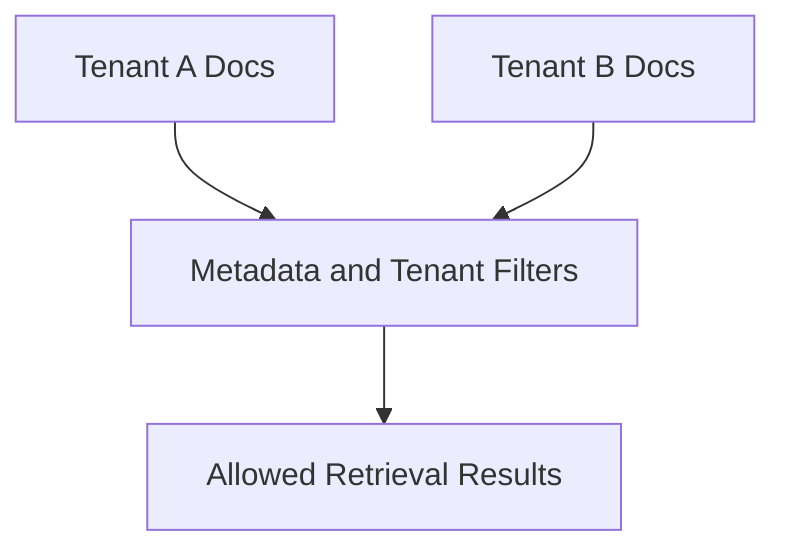
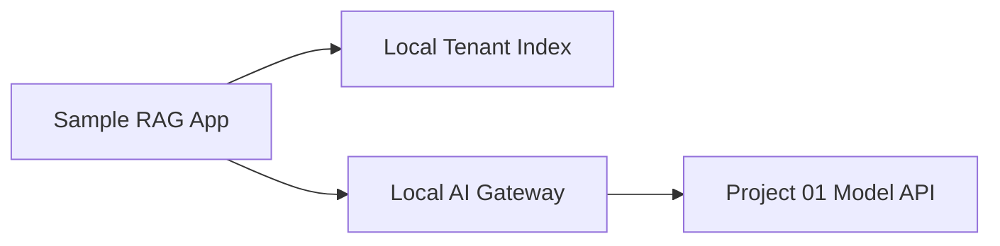

# Module 09 Architecture

```mermaid
flowchart LR
    Docs[Documents] --> Ingest[Ingestion Pipeline]
    Ingest --> Chunk[Chunking]
    Chunk --> Embed[Embedding Step]
    Embed --> Index[Vector or Index Store]

    Query[User Query] --> QueryEmbed[Query Embedding]
    QueryEmbed --> Retrieve[Retrieval]
    Retrieve --> Rerank[Reranking]
    Rerank --> Context[Grounded Context]
    Context --> Gateway[AI Gateway]
    Gateway --> Model[Model Backend]
```

```mermaid
flowchart TB
    TenantA[Tenant A Docs] --> Filter[Metadata and Tenant Filters]
    TenantB[Tenant B Docs] --> Filter
    Filter --> Results[Allowed Retrieval Results]
```

```mermaid
flowchart LR
    SampleRAG[Sample RAG App] --> LocalIndex[Local Tenant Index]
    SampleRAG --> Gateway[Local AI Gateway]
    Gateway --> ModelAPI[Project 01 Model API]
```