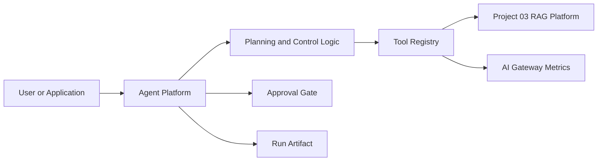
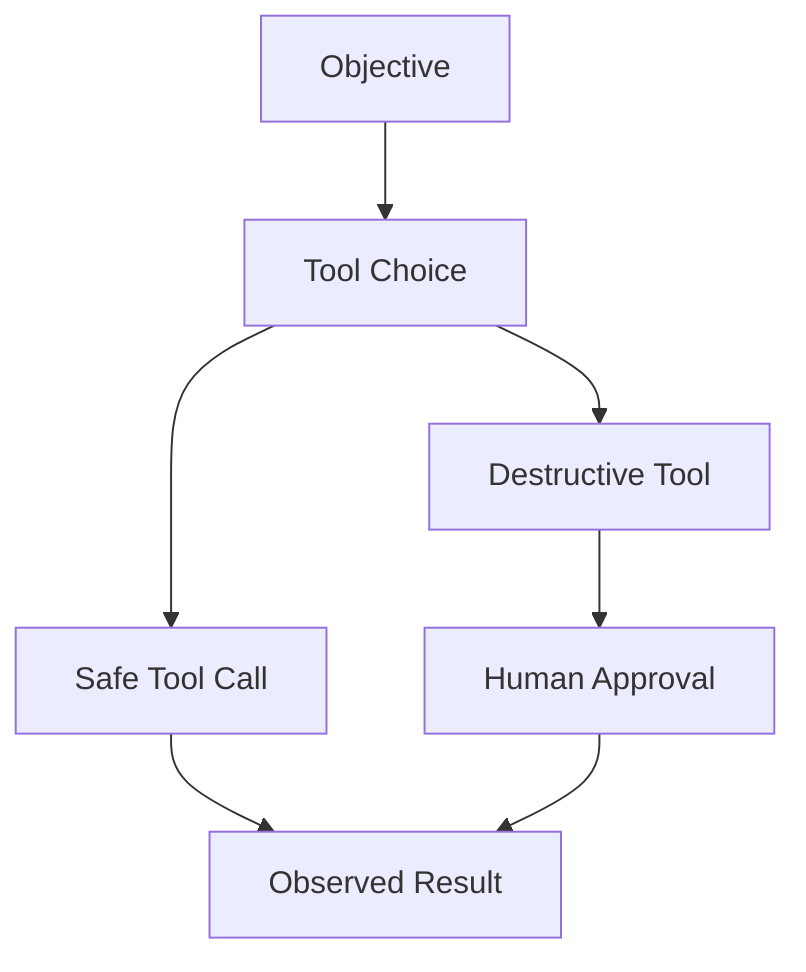
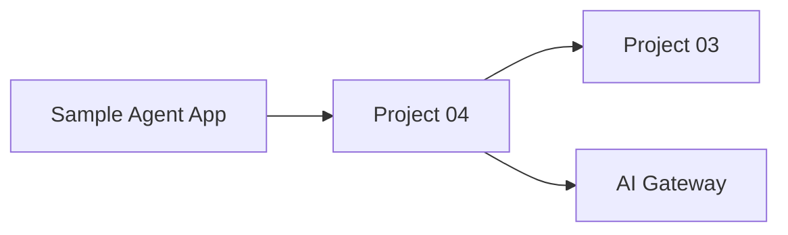

# Module 10 Architecture

```mermaid
flowchart LR
    User[User or Application] --> Agent[Agent Platform]
    Agent --> Planner[Planning and Control Logic]
    Planner --> Tools[Tool Registry]
    Tools --> RAG[Project 03 RAG Platform]
    Tools --> Gateway[AI Gateway Metrics]
    Agent --> Approval[Approval Gate]
    Agent --> Audit[Run Artifact]
```

```mermaid
flowchart TB
    Objective[Objective] --> ToolChoice[Tool Choice]
    ToolChoice --> Safe[Safe Tool Call]
    ToolChoice --> Risky[Destructive Tool]
    Risky --> Human[Human Approval]
    Safe --> Result[Observed Result]
    Human --> Result
```

```mermaid
flowchart LR
    SampleAgent[Sample Agent App] --> AgentPlatform[Project 04]
    AgentPlatform --> Project03[Project 03]
    AgentPlatform --> AIGateway[AI Gateway]
```