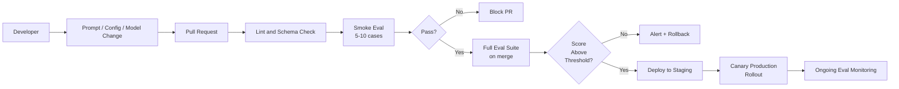
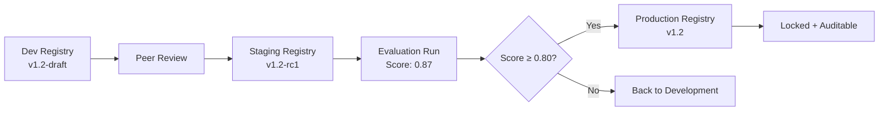
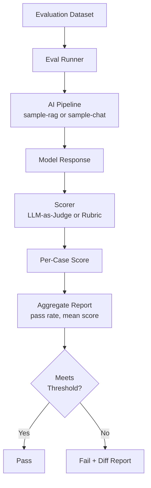
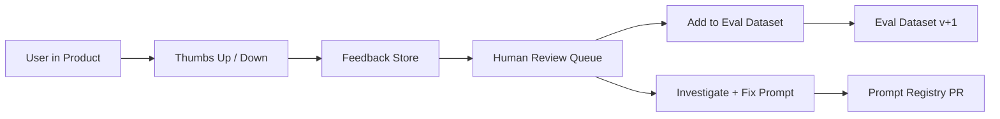
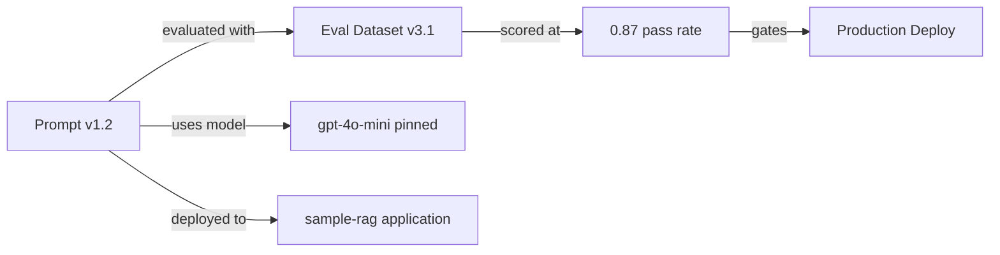

# Module 11 Architecture

## LLMOps Pipeline

```mermaid
flowchart LR
    Dev[Developer] --> Change[Prompt / Config / Model Change]
    Change --> PR[Pull Request]
    PR --> Lint[Lint and Schema Check]
    Lint --> SmokeEval[Smoke Eval\n5-10 cases]
    SmokeEval --> Pass{Pass?}
    Pass -- No --> Reject[Block PR]
    Pass -- Yes --> FullEval[Full Eval Suite\non merge]
    FullEval --> Score{Score\nAbove\nThreshold?}
    Score -- No --> Rollback[Alert + Rollback]
    Score -- Yes --> Deploy[Deploy to Staging]
    Deploy --> Canary[Canary Production\nRollout]
    Canary --> Monitor[Ongoing Eval Monitoring]
```

## Prompt Versioning and Promotion

```mermaid
flowchart LR
    Dev[Dev Registry\nv1.2-draft] --> Review[Peer Review]
    Review --> Staging[Staging Registry\nv1.2-rc1]
    Staging --> Eval[Evaluation Run\nScore: 0.87]
    Eval --> Threshold{Score ≥ 0.80?}
    Threshold -- Yes --> Prod[Production Registry\nv1.2]
    Threshold -- No --> Reject[Back to Development]
    Prod --> Lock[Locked + Auditable]
```

## Evaluation Loop

```mermaid
flowchart TB
    Dataset[Evaluation Dataset] --> Runner[Eval Runner]
    Runner --> Pipeline[AI Pipeline\nsample-rag or sample-chat]
    Pipeline --> Response[Model Response]
    Response --> Scorer[Scorer\nLLM-as-Judge or Rubric]
    Scorer --> Score[Per-Case Score]
    Score --> Aggregate[Aggregate Report\npass rate, mean score]
    Aggregate --> Gate{Meets\nThreshold?}
    Gate -- Yes --> Pass[Pass]
    Gate -- No --> Fail[Fail + Diff Report]
```

## Human Feedback Pipeline

```mermaid
flowchart LR
    User[User in Product] --> Feedback[Thumbs Up / Down]
    Feedback --> FeedbackStore[Feedback Store]
    FeedbackStore --> Review[Human Review Queue]
    Review --> GoodExamples[Add to Eval Dataset]
    Review --> BadExamples[Investigate + Fix Prompt]
    GoodExamples --> Dataset[Eval Dataset v+1]
    BadExamples --> PromptChange[Prompt Registry PR]
```

## Platform Artifact Relationships

```mermaid
flowchart LR
    Prompt[Prompt v1.2] -- evaluated with --> EvalDataset[Eval Dataset v3.1]
    Prompt -- uses model --> Model[gpt-4o-mini pinned]
    Prompt -- deployed to --> App[sample-rag application]
    EvalDataset -- scored at --> Score[0.87 pass rate]
    Score -- gates --> Deploy[Production Deploy]
```
