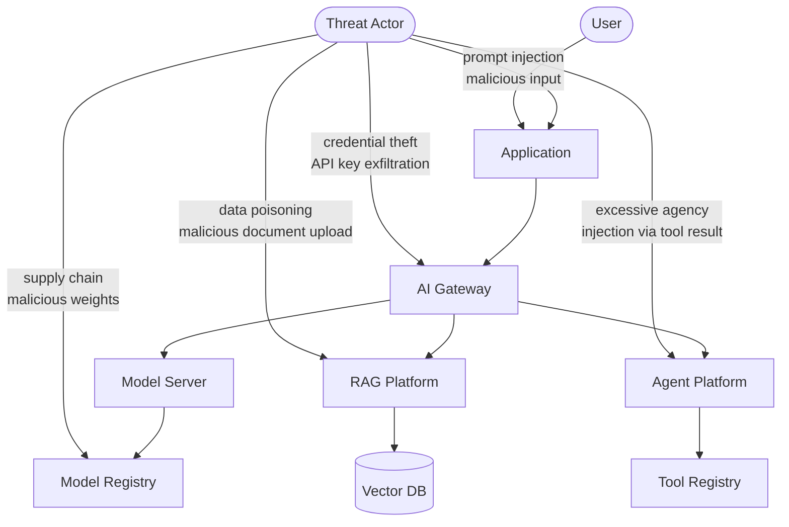
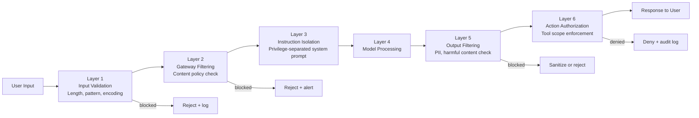
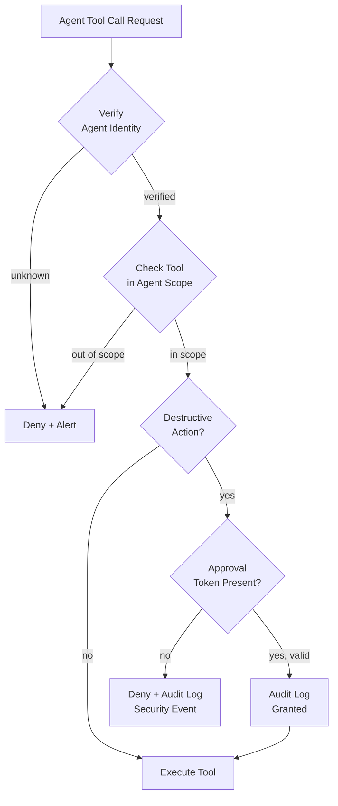
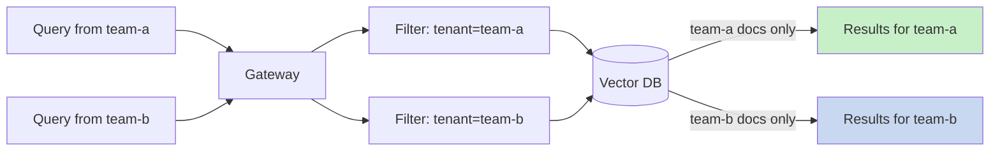

# Module 13 Architecture

## AI Platform Threat Model

```mermaid
flowchart TB
    Attacker([Threat Actor])
    User([User])

    User --> App[Application]
    Attacker -- "prompt injection\nmalicious input" --> App
    Attacker -- "credential theft\nAPI key exfiltration" --> GW[AI Gateway]
    Attacker -- "data poisoning\nmalicious document upload" --> RAG[RAG Platform]
    Attacker -- "supply chain\nmalicious weights" --> ModelStore[Model Registry]
    Attacker -- "excessive agency\ninjection via tool result" --> Agent[Agent Platform]

    App --> GW
    GW --> Model[Model Server]
    GW --> RAG
    GW --> Agent
    Model --> ModelStore
    RAG --> VDB[(Vector DB)]
    Agent --> Tools[Tool Registry]
```

## Defense-in-Depth Layers

```mermaid
flowchart LR
    Input[User Input] --> L1[Layer 1\nInput Validation\nLength, pattern, encoding]
    L1 --> L2[Layer 2\nGateway Filtering\nContent policy check]
    L2 --> L3[Layer 3\nInstruction Isolation\nPrivilege-separated system prompt]
    L3 --> L4[Layer 4\nModel Processing]
    L4 --> L5[Layer 5\nOutput Filtering\nPII, harmful content check]
    L5 --> L6[Layer 6\nAction Authorization\nTool scope enforcement]
    L6 --> Response[Response to User]

    L1 -- "blocked" --> Blocked1[Reject + log]
    L2 -- "blocked" --> Blocked2[Reject + alert]
    L5 -- "blocked" --> Blocked5[Sanitize or reject]
    L6 -- "denied" --> Blocked6[Deny + audit log]
```

## Agent Zero-Trust Authorization

```mermaid
flowchart TD
    AgentReq[Agent Tool Call Request] --> Identity{Verify\nAgent Identity}
    Identity -- "unknown" --> Deny[Deny + Alert]
    Identity -- "verified" --> Scope{Check Tool\nin Agent Scope}
    Scope -- "out of scope" --> Deny
    Scope -- "in scope" --> Destructive{Destructive\nAction?}
    Destructive -- "no" --> Execute[Execute Tool]
    Destructive -- "yes" --> Approval{Approval\nToken Present?}
    Approval -- "no" --> DenyLog[Deny + Audit Log\nSecurity Event]
    Approval -- "yes, valid" --> AuditLog[Audit Log\nGranted]
    AuditLog --> Execute
```

## RAG Multi-Tenant Isolation

```mermaid
flowchart LR
    Q1[Query from team-a] --> GW[Gateway]
    Q2[Query from team-b] --> GW
    
    GW --> Filter1[Filter: tenant=team-a]
    GW --> Filter2[Filter: tenant=team-b]
    
    Filter1 --> VDB[(Vector DB)]
    Filter2 --> VDB
    
    VDB -- "team-a docs only" --> R1[Results for team-a]
    VDB -- "team-b docs only" --> R2[Results for team-b]
    
    style R1 fill:#c8f0c8
    style R2 fill:#c8d8f0
```
