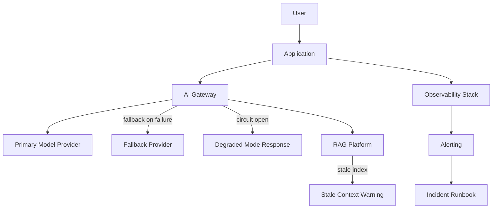
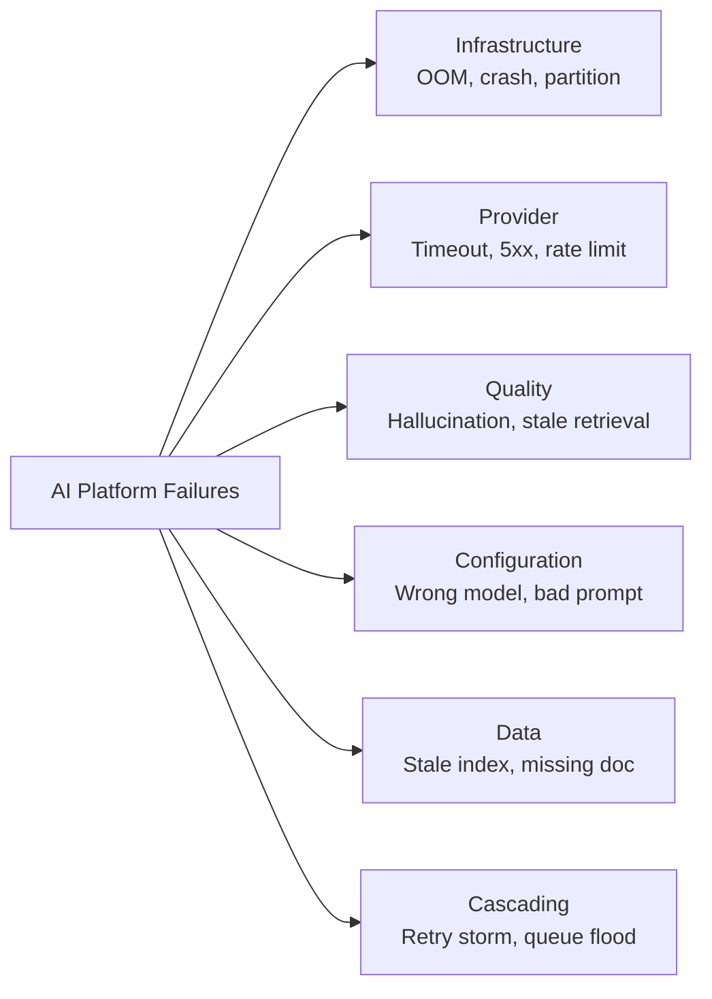
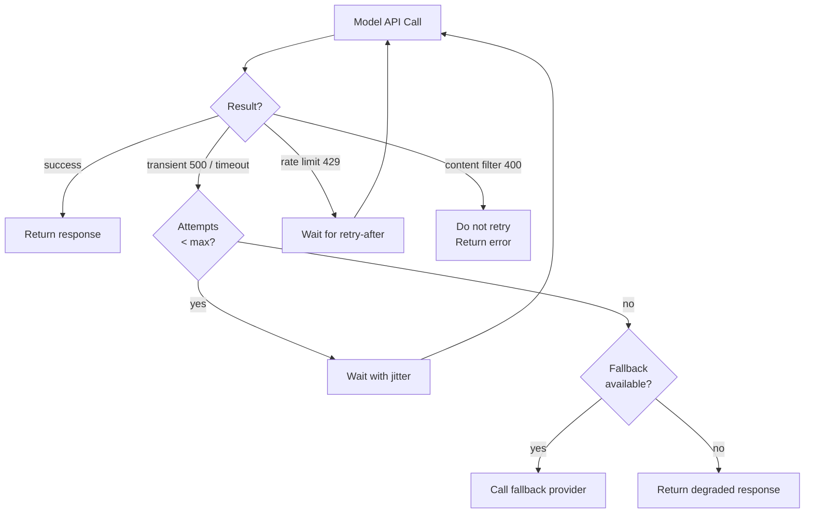
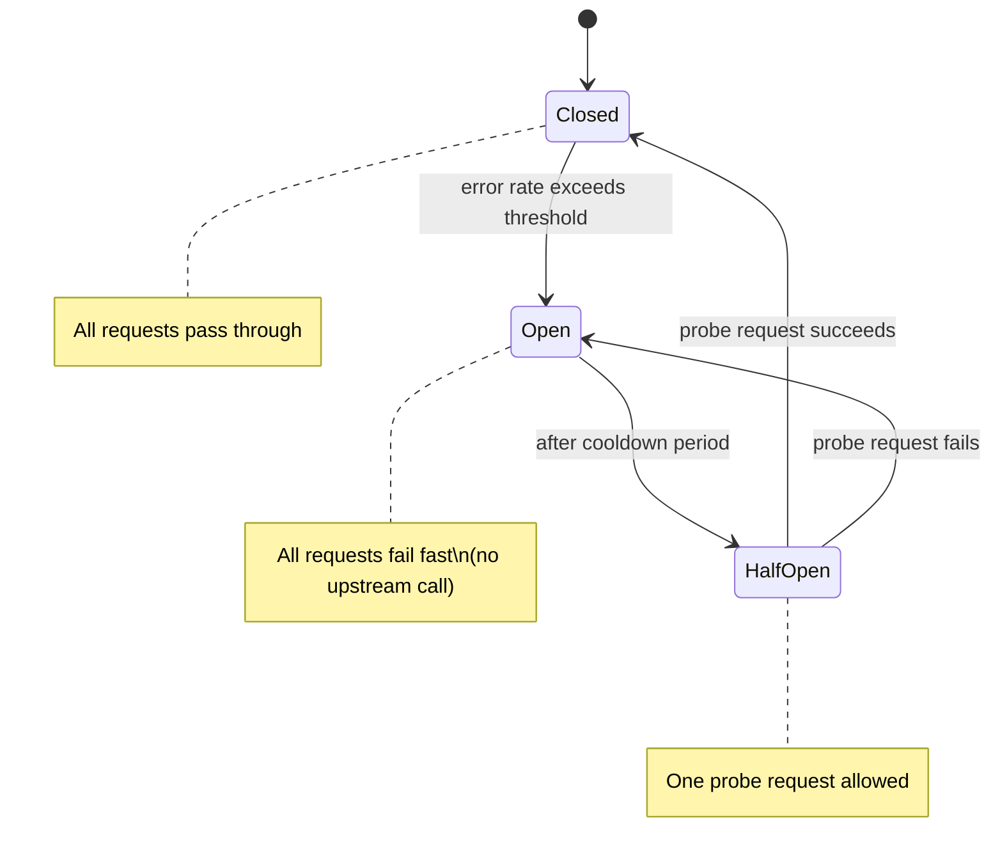
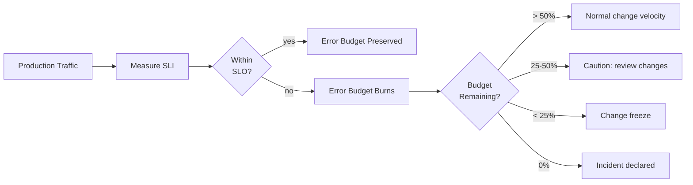

# Module 14 Architecture

## Reliability Layers

```mermaid
flowchart TB
    User[User] --> App[Application]
    App --> GW[AI Gateway]
    GW --> Primary[Primary Model Provider]
    GW -- "fallback on failure" --> Secondary[Fallback Provider]
    GW -- "circuit open" --> Degraded[Degraded Mode Response]

    GW --> RAG[RAG Platform]
    RAG -- "stale index" --> StaleWarning[Stale Context Warning]

    App --> Monitor[Observability Stack]
    Monitor --> Alert[Alerting]
    Alert --> Runbook[Incident Runbook]
```

## Failure Taxonomy Map

```mermaid
flowchart LR
    Failures[AI Platform Failures]
    Failures --> Infra[Infrastructure\nOOM, crash, partition]
    Failures --> Provider[Provider\nTimeout, 5xx, rate limit]
    Failures --> Quality[Quality\nHallucination, stale retrieval]
    Failures --> Config[Configuration\nWrong model, bad prompt]
    Failures --> Data[Data\nStale index, missing doc]
    Failures --> Cascade[Cascading\nRetry storm, queue flood]
```

## Retry and Fallback Decision Tree

```mermaid
flowchart TD
    Call[Model API Call] --> Result{Result?}
    Result -- "success" --> Done[Return response]
    Result -- "transient 500 / timeout" --> Retry{Attempts\n< max?}
    Retry -- "yes" --> Backoff[Wait with jitter] --> Call
    Retry -- "no" --> Fallback{Fallback\navailable?}
    Result -- "rate limit 429" --> Wait[Wait for retry-after] --> Call
    Result -- "content filter 400" --> NoRetry[Do not retry\nReturn error]
    Fallback -- "yes" --> FallbackCall[Call fallback provider]
    Fallback -- "no" --> Degrade[Return degraded response]
```

## Circuit Breaker States

```mermaid
stateDiagram-v2
    [*] --> Closed
    Closed --> Open : error rate exceeds threshold
    Open --> HalfOpen : after cooldown period
    HalfOpen --> Closed : probe request succeeds
    HalfOpen --> Open : probe request fails
    
    note right of Closed : All requests pass through
    note right of Open : All requests fail fast\n(no upstream call)
    note right of HalfOpen : One probe request allowed
```

## SLO Error Budget Flow

```mermaid
flowchart LR
    Traffic[Production Traffic] --> Measure[Measure SLI]
    Measure --> Good{Within\nSLO?}
    Good -- "yes" --> Budget[Error Budget Preserved]
    Good -- "no" --> Burn[Error Budget Burns]
    Burn --> BudgetLevel{Budget\nRemaining?}
    BudgetLevel -- "> 50%" --> Normal[Normal change velocity]
    BudgetLevel -- "25-50%" --> Caution[Caution: review changes]
    BudgetLevel -- "< 25%" --> Freeze[Change freeze]
    BudgetLevel -- "0%" --> Incident[Incident declared]
```
