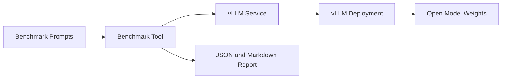
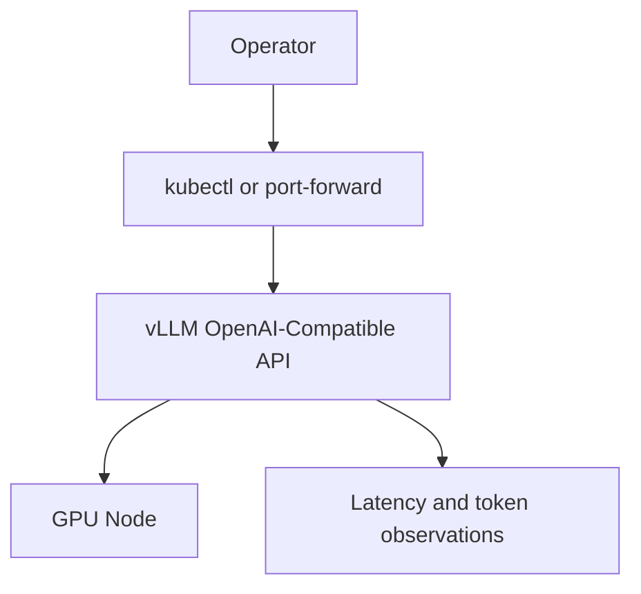

# Project 02 Architecture

```mermaid
flowchart LR
    Prompts[Benchmark Prompts] --> Bench[Benchmark Tool]
    Bench --> Service[vLLM Service]
    Service --> Deploy[vLLM Deployment]
    Deploy --> Model[Open Model Weights]
    Bench --> Report[JSON and Markdown Report]
```

```mermaid
flowchart TB
    User[Operator] --> Kubectl[kubectl or port-forward]
    Kubectl --> VLLM[vLLM OpenAI-Compatible API]
    VLLM --> GPU[GPU Node]
    VLLM --> Metrics[Latency and token observations]
```

The project keeps the client-side benchmark and the server-side deployment assets separate so the learner can see both sides of inference engineering.