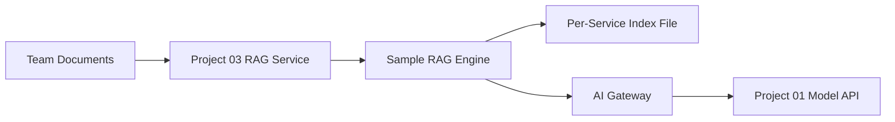
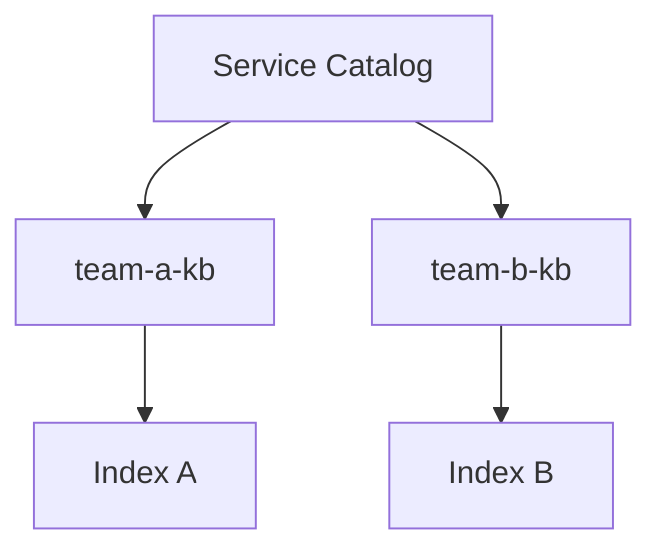

# Project 03 Architecture

```mermaid
flowchart LR
    Docs[Team Documents] --> Project03[Project 03 RAG Service]
    Project03 --> Engine[Sample RAG Engine]
    Engine --> Index[Per-Service Index File]
    Engine --> Gateway[AI Gateway]
    Gateway --> ModelAPI[Project 01 Model API]
```

```mermaid
flowchart TB
    Catalog[Service Catalog] --> ServiceA[team-a-kb]
    Catalog --> ServiceB[team-b-kb]
    ServiceA --> StateA[Index A]
    ServiceB --> StateB[Index B]
```

Project 03 deliberately keeps the engine and the service layer separate so the learner can see which parts belong to the reusable platform surface.