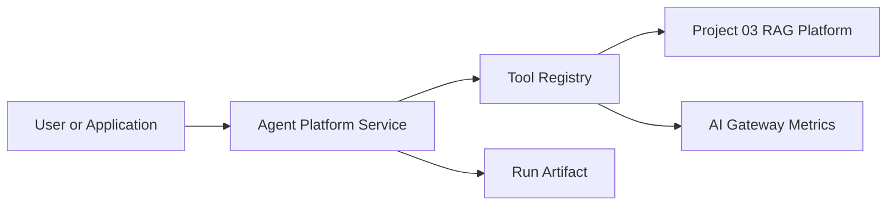
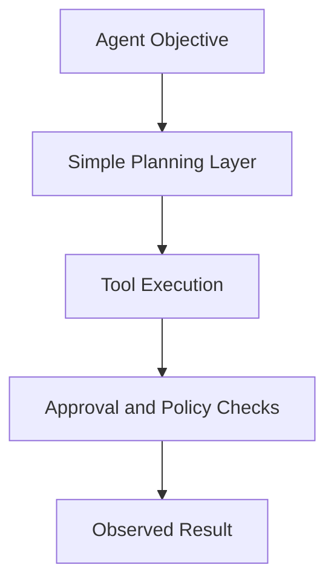

# Project 04 Architecture

```mermaid
flowchart LR
    User[User or Application] --> Agent[Agent Platform Service]
    Agent --> Tools[Tool Registry]
    Tools --> RAG[Project 03 RAG Platform]
    Tools --> Gateway[AI Gateway Metrics]
    Agent --> Report[Run Artifact]
```

```mermaid
flowchart TB
    Objective[Agent Objective] --> Planner[Simple Planning Layer]
    Planner --> ToolExec[Tool Execution]
    ToolExec --> Policy[Approval and Policy Checks]
    Policy --> Result[Observed Result]
```

This is intentionally small, but it models the most important platform concerns: discovery, policy, safe execution, and traceable outputs.